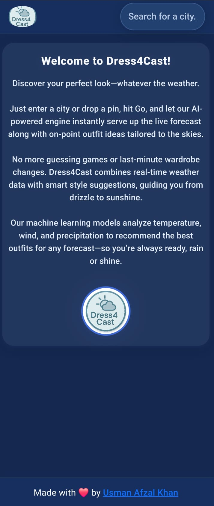
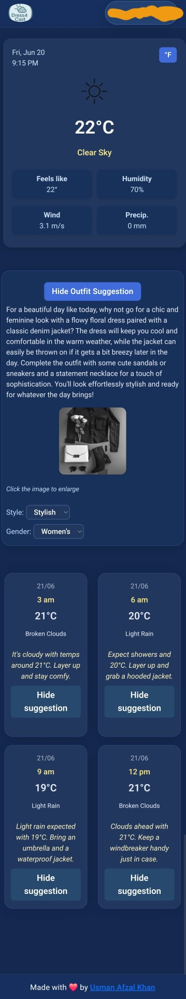

# 👗 Dress4Cast

[Try Dress4Cast Live 🌦️](https://dress4cast.netlify.app/)

Dress4Cast is an AI-powered style assistant that fuses live weather data with advanced generative AI to deliver personalized, human-tone outfit advice—no more guessing what to wear when the skies change. Built with React, Framer Motion, and the OpenWeather & OpenAI APIs, Dress4Cast offers an ultra-responsive, mobile-first experience that feels like chatting with your own personal stylist.

---

## 🚀 Key Highlights

- **⚡ AI-First Styling Engine**  
  - Prompts GPT-3.5-Turbo to craft a warm, conversational paragraph of outfit guidance based on current temperature, conditions, and user-selected style/gender.  
  - Generates a crisp, person-free outfit image via DALL·E that showcases garments and accessories on a neutral background.  
  - Caches last prompts and image URLs to eliminate redundant API calls when nothing has changed, ensuring snappy performance.

- **🌦️ Live Weather Integration**  
  - Fetches up-to-the-minute weather from OpenWeather’s `/weather` and `/forecast` endpoints in metric for accuracy.  
  - Displays dynamic date/time localized to the target timezone, with automatic refresh every 5 minutes to stay current.

- **🔄 Effortless Unit Toggle**  
  - Seamless switch between °C and °F for temperatures, powered by a lightweight conversion hook that avoids cumulative drift.  
  - Clearly indicates both units so users from any region feel at home.

- **📱 Mobile-First, Desktop-Enhanced Layout**  
  - Responsive 2×2 forecast grid on small screens and side-by-side panels on desktop.  
  - Elegant Framer Motion transitions for intro screen, weather card, forecasts, and outfit suggestions.

- **🖼️ Interactive AI Image Modal**  
  - Click any AI-generated outfit thumbnail to open a clean, full-size preview—no intrusive dark overlay.  
  - Dismiss by clicking outside or pressing Esc for an intuitive, distraction-free interaction.

- **⚙️ Modular, Readable Codebase**  
  - Custom hooks (`useGeo`, `useIsMobile`, `useOpenAI`) isolate side effects and promote reusability.  
  - CSS variables and component-scoped styling ensure consistent theming and brandability.  
  - Clearly separated components (`Header`, `WeatherDisplay`, `ForecastList`, `OutfitSuggestion`, `Footer`) each manage their own state and layout.

- **🔒 Secure Environment Handling**  
  - API keys managed through Vite’s `import.meta.env` system to prevent accidental public exposure.  
  - Production builds automatically strip out unused code and environment variables.

---

## 🤖 Under the AI Hood

1. **Text Generation**  
   - GPT-3.5-Turbo prompt template:  
     ```
     It's {temp}°{unit} with {description}. In one friendly paragraph, recommend a {style} {gender} outfit—no lists, just conversational tone.
     ```  
   - Temperature 0.7, max tokens 120 for a natural, concise narrative that reads like a human stylist.

2. **Image Generation**  
   - DALL·E request:  
     ```
     Photo of a {style} {gender} outfit on a neutral background—no people, clear garments and accessories.
     ```  
   - Single 512×512 output for crisp visuals that focus solely on the clothing.

3. **Performance Optimizations**  
   - Debounced geocoding for city autocomplete to minimize external API calls.  
   - `useEffect` dependency checks to skip duplicate AI calls when inputs haven’t changed.

---

## 📷 Screenshots

Place your `.png` or `.jpeg` files in a **`screenshots/`** folder at the project root, then reference them like so:

  
 

---


**Built with ❤️ and cutting-edge AI by [Usman Khan](https://github.com/usmanAfzalKhan)**

```
```
